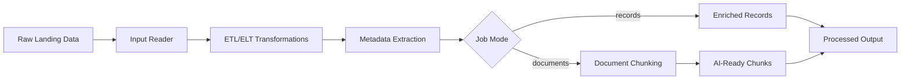

# Architecture

## Purpose

The Data Processing & Enrichment layer converts raw ingested data into standardized, analytics-ready and AI-ready assets.

## Flow

## Loose Coupling

This project integrates with `enterprise-data-pipeline` through shared data contracts instead of shared runtime code.

The ingestion project owns:

- source connectivity
- raw landing
- CDC, batch, streaming, and API ingestion mechanics

This project owns:

- cleansing
- normalization
- standardization
- chunking
- metadata enrichment
- AI-ready output shaping

The boundary between them is `input_uri` plus a raw landing format such as JSONL, object storage files, or platform datasets.

