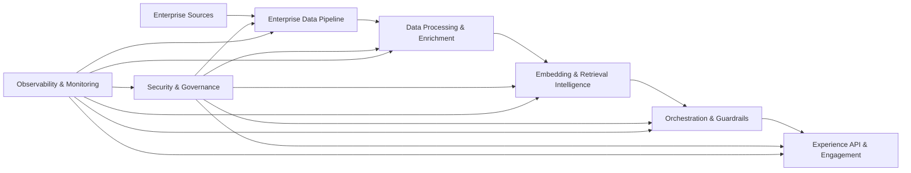

# Nexus Architecture

```mermaid
flowchart LR
  A["Enterprise Sources"] --> B["Enterprise Data Pipeline"]
  B --> C["Data Processing & Enrichment"]
  C --> D["Embedding & Retrieval Intelligence"]
  D --> E["Orchestration & Guardrails"]
  E --> F["Experience API & Engagement"]
  G["Security & Governance"] --> B
  G --> C
  G --> D
  G --> E
  G --> F
  H["Observability & Monitoring"] --> B
  H --> C
  H --> D
  H --> E
  H --> F
  H --> G
```

The root `nexus` package is the external entry point. Each layer remains loosely coupled and independently deployable.

