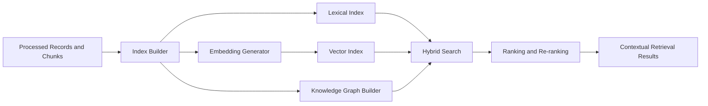

# Architecture

## Purpose

The Embedding & Retrieval Intelligence layer converts enriched enterprise data into a unified knowledge layer for AI systems.

## Flow

## Loose Coupling

This project consumes JSONL outputs from `data-processing-enrichment` through `input_uri` configuration. It does not import upstream code, so each layer can be deployed, scaled, and versioned independently.

## Local Stores

Local development uses JSON files for:

- vector embeddings
- lexical postings
- graph nodes and edges

Production deployments can replace these with managed vector and graph stores.

