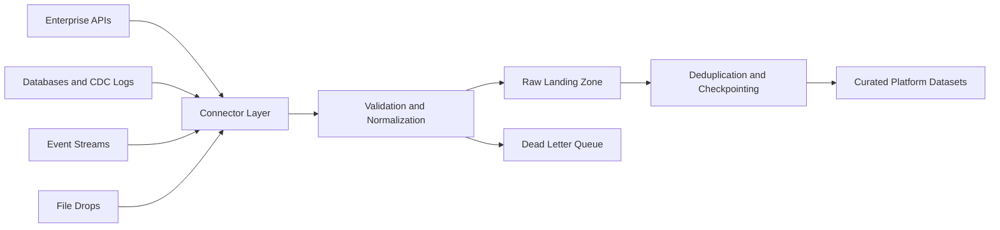

# Architecture

## Goals

The pipeline is designed to move data from enterprise systems into the platform with predictable latency, strong data integrity, and operational visibility.

## Flow

## Components

**Connector Layer**

Connectors isolate source-specific mechanics from pipeline behavior. Each connector emits a consistent `DataEvent` envelope so downstream processing does not depend on whether the source is an API, stream, batch file, or CDC log.

**Streaming Ingestion**

Streaming ingestion handles low-latency event movement from Kafka-compatible topics. Consumers should commit offsets only after validation, raw landing, and destination writes succeed.

**Batch Processing**

Batch jobs process scheduled extracts or file drops. Jobs are idempotent by primary key and checkpointed by event timestamp or source cursor.

**Change Data Capture**

CDC handlers translate source operations into platform mutations. Inserts and updates are upserts. Deletes are represented explicitly so downstream tables can choose hard-delete, soft-delete, or tombstone behavior.

**Integrity Controls**

The framework validates required fields, deduplicates by source and primary key, tracks checkpoints, and diverts invalid records to a dead-letter path for triage.

## Production Hardening Backlog

- Add a durable checkpoint store such as Postgres, Redis, DynamoDB, or the platform metadata service.
- Add OpenTelemetry traces and structured operational metrics.
- Add schema registry integration for event streams.
- Add a destination writer for the platform storage layer.
- Add deployment manifests for the target orchestrator.

