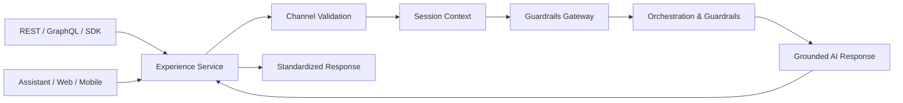

# Architecture

## Purpose

The Experience API & Engagement layer is the user and system entry point for enterprise AI services.

## Flow

## Loose Coupling

The engagement layer integrates with other layers through stable contracts:

- config references to upstream projects
- CLI or HTTP contracts to orchestration guardrails
- request and response models for API, GraphQL, and SDK consumers

It does not import code from ingestion, processing, retrieval, or guardrails projects.

