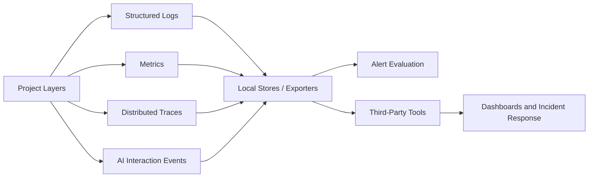

# Architecture

## Purpose

The Observability & Monitoring layer provides real-time visibility across platform services, data pipelines, and AI interactions.

## Flow

## Third-Party Tools

The config supports connection settings for:

- OpenTelemetry Collector
- Prometheus
- Grafana
- Datadog
- Splunk
- AWS CloudWatch

Local execution records JSONL files. Production deployments can add exporter implementations that push to these systems.

