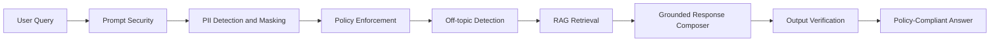

# Architecture

## Purpose

The Orchestration & Guardrails layer controls AI interactions with enterprise data by enforcing safety, policy, privacy, and grounded response requirements.

## Flow

## Loose Coupling

This project integrates with upstream layers through config paths and index files:

- `data-processing-enrichment` produces enriched records and chunks.
- `embedding-retrieval-intelligence` indexes those outputs.
- `orchestration-guardrails` reads retrieval indexes for grounding and citations.

No runtime imports are shared across projects.

