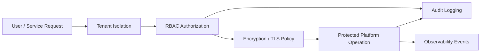

# Architecture

## Purpose

The Security & Governance layer provides cross-cutting controls for platform access, privacy, compliance, and operational transparency.

## Flow

## Loose Coupling

This project integrates with the rest of the architecture through policy decisions and audit/telemetry contracts. Other layers can call this layer before serving data or AI responses, but no runtime imports are required.

